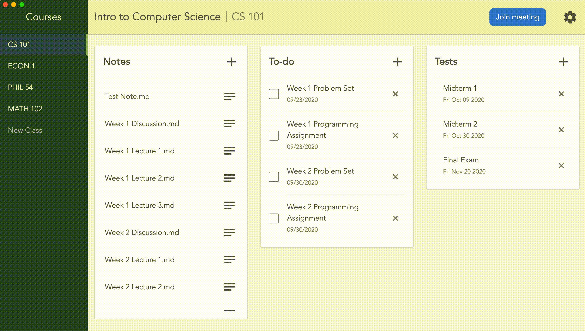

# Course Portal
A one-stop shop to manage your work and notes for courses,
built using Electron.

Created by Tejas Narayanan.

## Features

### Notes
Create new notes in plain text or markdown by pressing the + button in
the notes section. You can start with a clean slate, or you can use
templates that auto-fill the date, class name, and more. You can also
create custom templates to fit the needs of your specific note-taking
style.

Notes will open in the default application on your computer.

You choose where you want your notes stored on your computer; they're
not in any server or app-specific folder. That way, your notes are
safe, even if you choose to remove Course Portal.

### To-dos
Keep track of upcoming deadlines and homework by using the built-in
todos. Each to-do has an optional description, where you can put
due dates or any additional notes.

### Tests
Organize your tests, midterms, and finals for each course. Inputted
tests are sorted chronologically, so you always know what's coming
up next.

### Other features
Set a video call link, so your virtual classes are one button away.
No more searching through old emails trying to find the links for
your courses!

## Demo

#### Creating a new course

#### Creating a note

#### Creating a to-do item
